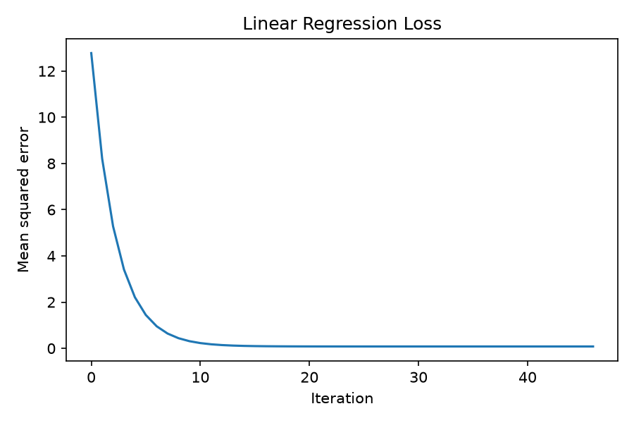
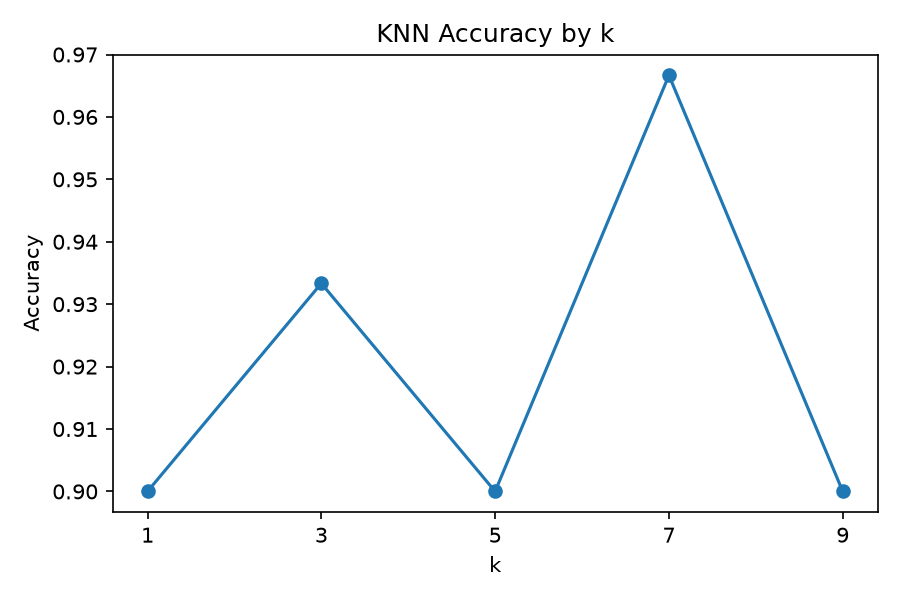
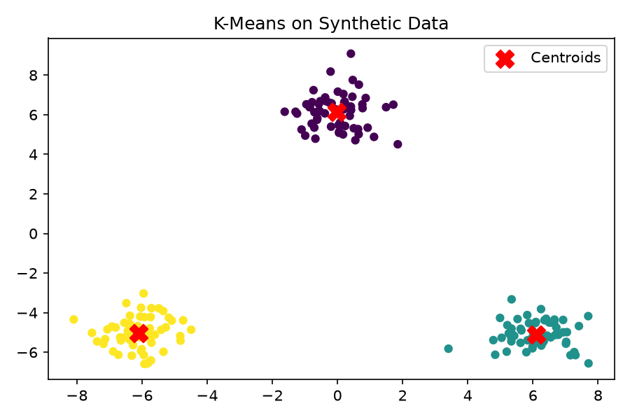
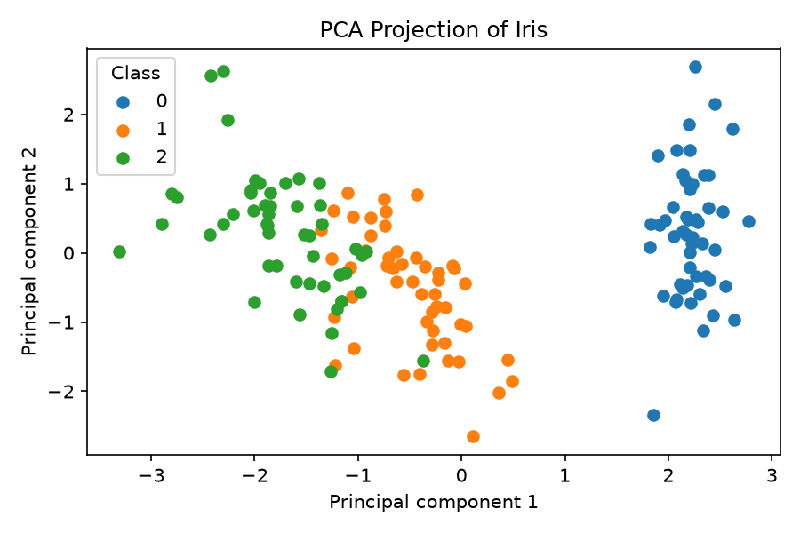

# ML Foundations from Scratch

A learning-focused Python package that connects core machine learning mathematics
to tested, reusable NumPy implementations. It is designed as an educational and
portfolio project—not as a production ML framework.

## What “from scratch” means

The algorithm modules do not call ready-made scikit-learn estimators. NumPy powers
the numerical work; scikit-learn is a development dependency used only for
datasets, evaluation, and reference comparisons in demos and tests.

## Included algorithms and utilities

- `StandardScaler` and reproducible `train_test_split`
- Linear Regression using batch gradient descent
- k-Nearest Neighbors classification using Euclidean distance
- K-Means clustering with reproducible multi-start initialization
- Principal Component Analysis using covariance eigendecomposition
- MSE, R², accuracy, and confusion matrix metrics

Every estimator uses a familiar `fit`/`predict` or `transform` API, validates
input shapes and finite values, and exposes learned attributes with a trailing
underscore.

## Mathematical foundations

| Component | Main ideas |
| --- | --- |
| StandardScaler | feature mean, population variance, z-scores |
| Linear Regression | MSE, derivatives, gradients, iterative optimization |
| KNN | vectors, Euclidean distance, majority vote, feature scale |
| K-Means | nearest-centroid assignment, arithmetic means, inertia |
| PCA | centering, covariance, eigenvalues, eigenvectors, projection |

See [Mathematical Notes](docs/mathematical-foundations.md) for formulas and
implementation connections.

## Installation

Python 3.11 or newer is required. The commands below target Git Bash on Windows.

```bash
git clone https://github.com/agirkayamemin/ml-foundations-from-scratch.git
cd ml-foundations-from-scratch
python -m venv .venv
source .venv/Scripts/activate
python -m pip install --editable ".[dev]"
```

## Python API

```python
import numpy as np

from ml_foundations import LinearRegression, StandardScaler

X = np.array([[1.0], [2.0], [3.0], [4.0]])
y = np.array([3.0, 5.0, 7.0, 9.0])

scaler = StandardScaler()
X_scaled = scaler.fit_transform(X)
model = LinearRegression(learning_rate=0.1).fit(X_scaled, y)

print(model.predict(X_scaled))
print(model.score(X_scaled, y))
```

## CLI demos

Each command prints a deterministic JSON summary. Add `--output-dir outputs` to
save PNG figures.

```bash
python -m ml_foundations demo linear-regression --output-dir outputs
python -m ml_foundations demo knn --output-dir outputs
python -m ml_foundations demo kmeans --output-dir outputs
python -m ml_foundations demo pca --output-dir outputs
```

An installed console command is also available:

```bash
ml-foundations demo pca
```

## Verified reference comparisons

The following deterministic demo results were generated with seed `42`. Cluster
quality uses label-independent metrics because cluster IDs can be permuted.

| Experiment | From-scratch result | scikit-learn reference |
| --- | ---: | ---: |
| Linear Regression test R² | 0.9971 | 0.9971 |
| KNN Iris accuracy (`k=5`) | 0.9000 | 0.9000 |
| K-Means synthetic inertia | 203.9742 | 203.9742 |
| PCA first two variance ratios | 0.7296, 0.2285 | 0.7296, 0.2285 |

These values demonstrate agreement for the fixed examples, not universal
equivalence across every dataset or numerical edge case.

## Example figures

| Linear Regression | KNN |
| --- | --- |
|  |  |

| K-Means | PCA |
| --- | --- |
|  |  |

## Tests and quality checks

```bash
python -m pytest
python -m pytest --cov=ml_foundations --cov-report=term-missing
python -m ruff check .
python -m ruff format --check .
```

GitHub Actions runs the suite on Python 3.11, 3.12, and 3.13.

## Project structure

```text
ml-foundations-from-scratch/
├── src/ml_foundations/   # reusable package and CLI
├── tests/                # unit, edge-case, reference, and CLI tests
├── examples/             # reproducible example instructions
├── docs/                 # mathematics, figures, and delivery report
├── .github/workflows/    # continuous integration
├── pyproject.toml        # package and tool configuration
└── README.md
```

## Limitations

- Implementations prioritize clarity over large-scale speed and memory efficiency.
- KNN computes distances to every training sample and has no tree index.
- K-Means uses random observed samples rather than K-Means++ initialization.
- Linear Regression provides batch gradient descent only and expects scaled data
  when feature magnitudes differ substantially.
- PCA uses a covariance matrix, which is less suitable than direct SVD for very
  high-dimensional or numerically ill-conditioned data.
- Classification splitting is reproducible but not stratified.

## Possible future work

- Mini-batch optimization and regularized linear models
- Weighted KNN and additional distance metrics
- K-Means++ and multiple convergence diagnostics
- SVD-based PCA and whitening
- Stratified splitting and cross-validation helpers

## License

Licensed under the [MIT License](LICENSE).
